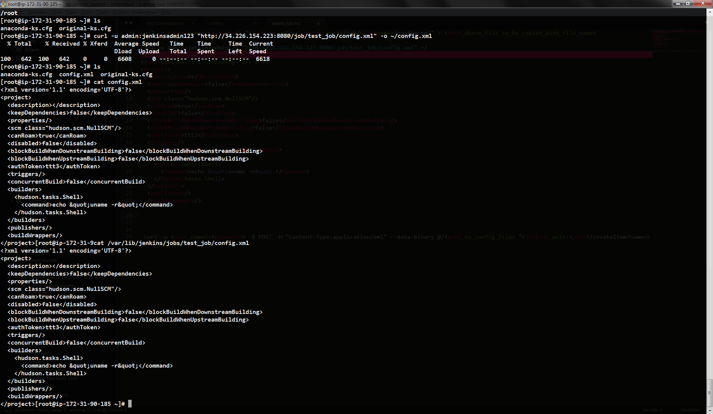
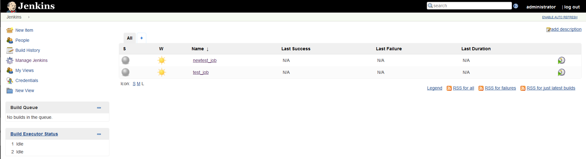

#### To get the config file of any jenkins job:     

* `curl -u <user_name>:<password> "<jenkins_url>:<jenkins_port>/job/<job_name>/config.xml" > -o <path/where/filetobecopied/filename>`

> `curl -u admin:jenkinsadmin123 "http://34.226.154.223:8080/job/test_job/config.xml" -o ~/config.xml`

#### To see the instance region:

* `curl -u <user_name>:<password> -X POST -H "Content-Type:application/xml" --data-binary @/<path_to_config_file> "<jenkins_url>:<port>/createItem?name=<new_job_name>"`

> `curl -u admin:jenkinsadmin123 -X POST -H "Content-Type:application/xml" --data-binary @//root/newconfig.xml "http://34.226.154.223:8080/createItem?name=newtest_job"`

#### To trigger jenkins builds remotely : 

* `curl -u <user_name>:<password> "<jenkins_url>:<jenkins_port>/job/<job_name>/build?token=<TOKEN_NAME>`

> `curl -u admin:jenkinsadmin123 "http://34.226.154.223:8080/job/test_job/build?token=ttt3"`

