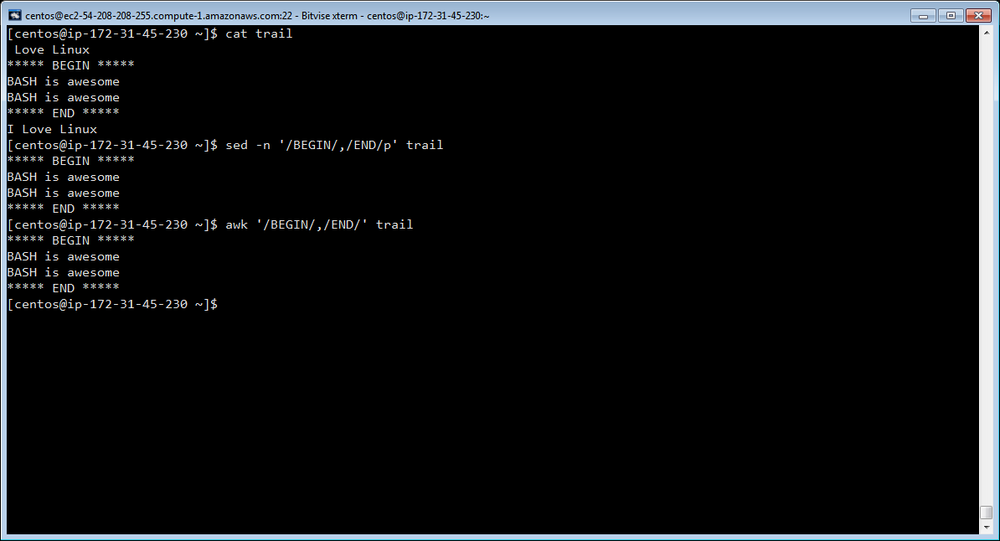
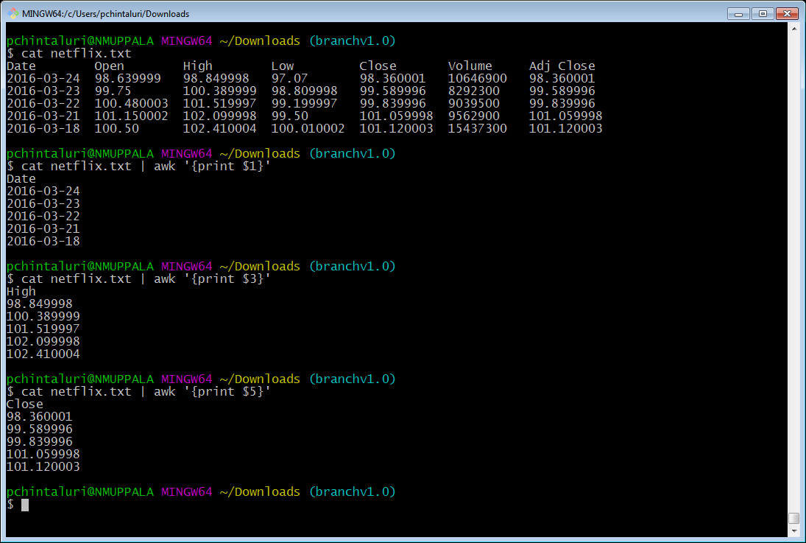
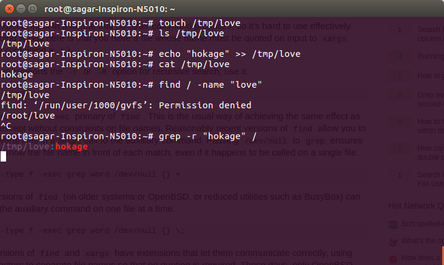
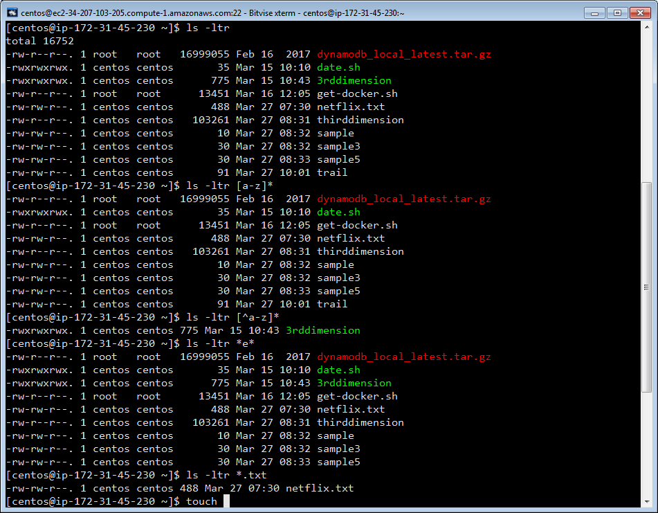

# **Shell Tips**

## **Exit status codes:**

**"Each Linux command returns a status when it terminates normally or abnormally"** which are called  **"exit status codes"**

* **`echo $?` is used to see the exit status codes**

* `grep -q [PATTERN] [FILE] && echo $?`

  - The exit status is **0 (true)** if the pattern was found
  - The exit status is **1 (false)** if the pattern was not found

**example:**

* `grep -q 'SOME_PATTERN' 'SOME_FILE' && echo $?`  (or) `grep -q 'SOME_PATTERN' 'SOME_FILE' ; echo $?`

* `grep -q 'root' '/etc/passwd' && echo $?`   (or) `grep -q 'user' '/etc/passwd' ; echo $?`

## **Command to check whether a file exists:**

* `test -f FILENAME/pathofthefile` (or)  `[ -f FILENAME/pathofthefile ]`      
**example:                      **
* `test -f /etc/passwd ; echo $?`   (or) `[ -f /etc/passwd ] ; echo $?`    
>if the output is **0** then file exists in the path(true)  
>if the output is **1** then file exists in the path(true)

* if **!** is kept after test the the ouput will be **negated**    
(`test ! -f /etc/bebebe ; echo $?` (or) `[ ! -f /etc/bebebe ] ; echo $?` )

*Test if the file exists and print a corresponding message in the each case:*

* ` [ -f "/etc/passwd" ] && echo "The file exists" || echo "The file does not exist" `

  *output:*  The file exists

* ` [ -f "/etc/bebebe" ] && echo "The file exists" || echo "The file does not exist" `

  *output:*  The file exists

#### Command to check whether a __*directory*__ exists:   

  * `test -d /etc ; echo $?` (or) `[ -d /etc ] ; echo $?`

## **Print using awk and sed:    **

*Print Lines Between Two Patterns with sed:*

* `sed -n '/StartPattern/,/EndPattern/p' FileName/pathofthefile`

*Print Lines Between Two Patterns with awk:*

* `awk '/StartPattern/,/EndPattern/' FileName/pathofthefile`

test123

*Print columns with awk:*

* `cat netflix.txt | awk '{print $3}'`

## **"find" and "grep":**
* `find / -name  "love"`
* `find <pathforsearch> <typeofsearch> "<searchsring>"`

* `grep -r "love" /`
* `grep <flag> "<searchstring>" <pathforsearch>`

## **Command to replace a string in a file with new string :**

* ` sed -i -e 's/oldstring/newstring/g' /pathofthefile

**example:**
* `sed -i -e 's/chicorita/meganium/g' /home/ec2-user/pokemon

## **List the files :**

* `ls -ltr [range of ]`

> For reference: [shellhacks.com](https://www.shellhacks.com/bash-test-if-file-exists/)
